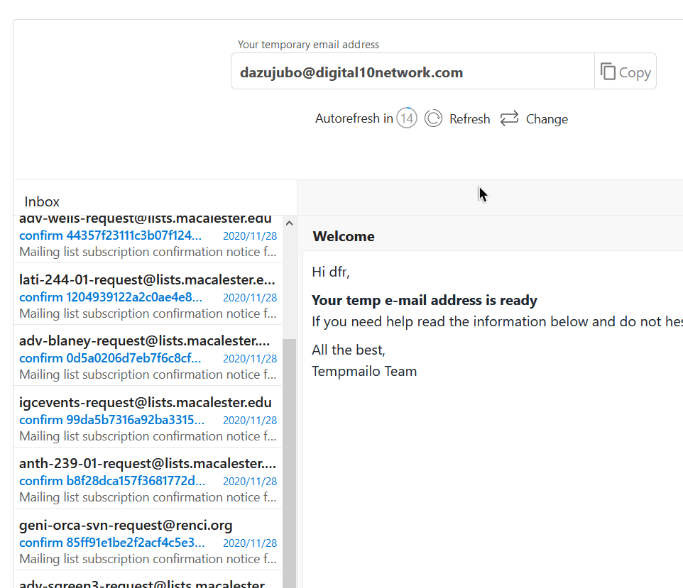

# Fast Mail Bomber via Mailman


Fast Mail Bomber via Mailman (also FMB for short) is an email bombing/spamming tool written in php. FMB bombs the target's mailbox by sending bulk emails via mailman services hosted by different providers.




**DISCLAIMER: THIS PROJECT IS FOR ACADEMIC PURPOSES ONLY. THE DEVELOPERS TAKE NO RESPONSIBILITY FOR ILLEGAL USAGE AND/OR POTENTIAL HARMS.**

## Requirements

- PHP >= 5.5
- cURL extension support

## Features

- Automatically get mailman servers (providers) from Shodan or import from local files.
- Multithreading bombing process.
- 150+ built-in providers & 3500+ built-in nodes list, providing efficiency.
- Reliable exception handling mechanism.

## Installation

### 1. Installing requirements

FMB uses [Guzzle](https://github.com/guzzle/guzzle). Please install required libraries using composer:

```bash
composer update
```

If you don't have composer installed, please refer to <https://getcomposer.org/>

### 2. Configuring

Copy `config.example.php` to `config.php` and edit it according to the annotations in the file to suit your needs.

## Usage

**Concept explanations:**

Provider: A mailman server, which usually contains a `listinfo` page listing all subscription nodes. eg. `http://lists.centos.org/mailman/listinfo`

Node: A subscription node on a mailman server, which can be used to send subscription confirmation emails to a target. eg. `http://lists.centos.org/mailman/subscribe/centos`

### 1. Updating Providers from Shodan or a local file

```bash
# Updating providers from Shodan. Set a Shodan api key in config.php first.
php index.php update-providers

# Importing providers from a local file. There's no restriction on file format/pattern since FMB uses RegExp to match provider urls.
php index.php import-providers <filepath>
```

Duplicate providers will be automatically removed.

### 2. Updating Nodes from the existing provider list

```bash
# Getting all subscription nodes that can be used for bombing from providers.
php index.php update-nodes
```

When getting nodes, unavailable providers previously added will be automatically added to a dead list and will not be used.

Duplicate nodes will be automatically removed.

### 3. Starting to bomb

```bash
php index.php start-bombing <email address>
```

Successful and failed requests will be printed via console. Press CTRL+C to cease the process.

**DISCLAIMER: THIS PROJECT IS FOR ACADEMIC PURPOSES ONLY. THE DEVELOPERS TAKE NO RESPONSIBILITY FOR ILLEGAL USAGE AND/OR POTENTIAL HARMS.**

## Testing results

I tested FMB's performance when bombing different mail providers once. Here's the results:

Proton Mail: 99.4% into Inbox, 0.6% into Trash.

Gmail: 83.2% into Inbox, 16.8% into Trash.

Outlook Mail: 77.1% into Inbox, 22.9% into Trash.

163 Mail: 100% into Inbox, 0% into Trash.

QQ Mail: 71% into Inbox, 29% into Trash.

Zoho Mail: 0% into Inbox, 15.9% into Newsletter, 84.1% into Trash.

Yandex Mail: 0% into Inbox, 100% into Trash.

## How to prevent being bombed

Concerning the mail template used in mailman's default settings, simply add the following text as one of your mailbox's filter rule:

```
Mailing list subscription confirmation notice for mailing list
```

## License

GPL v2.0